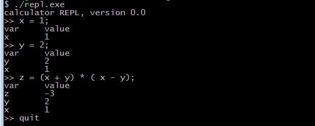
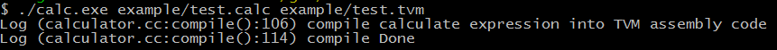
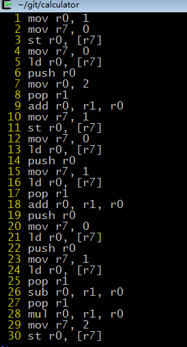

# Mini Calculator Interpreter & Compiler
A mini calculator interpreter and compiler, which has a REPL(Read Evaluate
Print Loop) as well as a Compilter compiles calculate expression into
[TVM](https://github.com/robin1001/tvm) assembly like middleware code.
It is tiny but with most part of a compiler, a hand-craft lexer, recursive down parser, 
simple symbol table and symantic analysis, a REPL interpreter 
as well as simple code generation and register allocation. 
it just for fun, showing all part of a simplest compiler. 

## File Details

* lexer.h lexer.cc: lexer
* parser.h parser.cc: parser
* node.h node.cc: AST node defination
* calculate.h calculate.cc: kernel implementaion of Calculator Interpreter & Compiler
* repl.cc: calculator REPL interpreter
* calc.cc: calculator compiler
* lexer_test.cc parser_test.cc symbol_table_test.cc: corresponding unit test files

## Usage

### Make
just type make to make everything down!

### Interpreter
type ./repl to run the Calculator REPL Interpreter, it prints every enviroment 
variable after each calculator expression.

### Compiler
type ./calc input_file [out_file] to run the Calculator Compiler, the out_file is 
optional, it write middleware result to stdout when the out_file is not provided.
(eg ./calc [example/test.calc](./example/test.calc) [example/test.tvm](./example/test.tvm)) 
#### run

#### compile result

